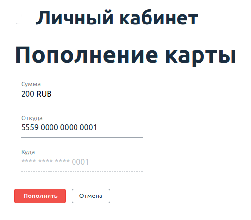

[](https://github.com/Ev-genia-Moon/BDD/actions/workflows/gradle.yml)

# Домашнее задание к занятию «BDD»

**Важно**: проекты с решением задач по данной теме реализуются с использованием Selenide.

## Задача

1. Инициализируйте на своём компьютере пустой Git-репозиторий.
1. Добавьте в него готовый файл [.gitignore](../.gitignore).
1. Добавьте в этот же каталог код ваших автотестов.
1. Сделайте необходимые коммиты.
1. Добавьте в каталог `artifacts` целевой сервис [app-ibank-build-for-testers.jar](app-ibank-build-for-testers.jar).
1. Создайте публичный репозиторий на GitHub и свяжите свой локальный репозиторий с удалённым.
1. Сделайте пуш — удостоверьтесь, что ваш код появился на GitHub.
1. Выполните интеграцию проекта с Github Actions ([инструкция](../github-actions-integration)) или Appveyor ([инструкция](https://github.com/netology-code/aqa-homeworks/tree/master/api-ci#appveyor)) на выбор, удостоверьтесь что автотесты в CI выполняются.
1. Поставьте бейджик сборки вашего проекта в файл README.md.
1. Ссылку на ваш проект отправьте в личном кабинете на сайте [netology.ru](https://netology.ru).
1. Задачи, отмеченные как необязательные, можно не сдавать, это не повлияет на получение зачёта.
1. Автотесты могут падать и сборка может быть красной из-за багов тестируемого приложения. В таком случае должны быть заведены репорты на обнаруженные в ходе тестирования дефекты в отдельных issues, [придерживайтесь схемы при описании](../report-requirements.md).

## Задача №1: Page Object's

Вам необходимо добить тестирование функции перевода с карты на карту. Разработчики пока реализовали возможность перевода только между своими картами, но уже хотят, чтобы вы всё протестировали.

Для этого они не поленились и захардкодили вам целого одного пользователя с двумя дебетовыми картами:
```
* login: 'vasya'
* password: 'qwerty123'
* verification code (hardcoded): '12345'
* cards:
    * first:
        * number: '5559 0000 0000 0001'
        * balance: 10 000 RUB
    * second:
        * number: '5559 0000 0000 0002'
        * balance: 10 000 RUB
```

После логина, который уже мы сделали на лекции, вы получите список карт:


Нажав на кнопку «Пополнить», вы перейдёте на страницу перевода средств:



При успешном переводе вы вернётесь назад на страницу со списком карт.

Это ключевой кейс, который нужно протестировать.

Нужно, чтобы вы через Page Object's добавили доменные методы:
* получения баланса по карте со страницы списка карт,
* выбора карты для пополнения,
* перевода с определённой карты на выбранную карту произвольной суммы.

При этом нужно помнить, что в шаблоне Page Object's принято для описания каждой страницы сайта реализовывать отдельный класс.

**Вы можете познакомиться с некоторыми подсказками [по реализации этой задачи](balance.md)**.

### Решение

[Задание к занятию «BDD»](https://github.com/Ev-genia-Moon/BDD/tree/main/src/test/java/ru/netology/web)

